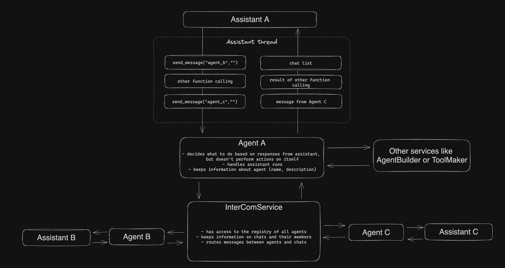

# InterComService for direct and group communication



This package implements a way for one-to-one and many-to-many communication between OpenAI assistants through function calling.
The main idea is that agents should decide on their own when to communicate and with whom.
To make this possible following things needs be done:

1. Assistants should be instructed with guidelines on how to communicate
2. Assistants should be provided with tools to send messages and create chats
3. Assistants should be provided with information about other agents they can communicate with
4. A middleware between assistants that takes message from one assistant and sends it to another (multiple assistants)

## Preparing OpenAI assistant for communication

### Assitant instructions and communication guideline

`intercom/instructions.md` is extended version of instructions from `agent_builder`.
Biggest addition is that now it includes communication guideline. The guideline includes instructions on how and when to communicate as well as information on how to use chat functions.

### New tools for communication

`intercom/tools.json` contains specification for new chat tools that can be used in function calling:

- send_message(chat_id, message) - sends message to a group chat or agent
- create_chat(agent_ids, name, description) - creates a new group chat
- add_chat_member(agent_id, chat_id) - adds agent from a chat
- remove_chat_member(agent_id, chat_id) - removes agent from a chat

### Chat list

Each message in thread includes a chat list that looks like this:

```json
{"id": "asst_4XixOcWw4Ut9Kz7Pv98dIxo6", "name": "Marketing Expert", "description": "Knows everything about marketing.", "type": "agent"}
{"id": "asst_dH1T9lUUD2aef21aglI9iVcw", "name": "Network Engineer", "description": "Knows everything about networks", "type": "agent"}
{"id": "asst_cLIyeNLWz6q1hx1HZDRn9K86", "name": "Founder", "description": "Founder of the new AI company that is taking over the world", "type": "agent"}
{"id": "da6be55c-42f5-4abd-9123-69a3fd630b04", "name": "AI-Agent Marketing Strategy", "description": "This chat is to discuss and strategize the marketing efforts for our autonomous AI agent startup. Homing in on the unique aspects our AI agents provide and tailoring our approach to meet the needs of design studios and businesses looking for such solutions.", "type": "group"}
```

Each object in the list has following fields:

- id: id of the agent or group chat. Agent will use to send messages
- name: name of the agent or chat. Doesn't server any particular function but improves readability
- description: description of the agent or chat and the most important part. Agents will decide with whom to communicate based on their description
- type: agent or group.

For now each agent is provided with a list of all existing agents and chats they are a memeber of. But this could be easily extended into something more complicated

## Implementation details

Now that our assistants are configured for communication we need a middleware that runs them.
Three main parts of this package:

1. Agent registry - keeps links to all agent so they can be accessed later
2. Agent - handles runs, processess function calling, sends messages to assistant. Uses InterComService to send messages to other agents
3. InterComService - routes messages between agents, uses Agent registry to access agents

## Agent registry

Small and simple module that stores links to all Agent instances.
Provides a function to retrieve agents by their id

## Agent class

Purpose of agent class is to process messages from assistant and send tools execution results to it.
In this implementation there's only one thread of messages per assitant between assistant and agent (that plays role of user). Which means all messages from other agents are stored in one context.
There two potential major issue with this approach:

1. Context window could quickly fill up if an agent has a lof of communication
2. It could be hard for assistant to keep continuity between conversation

Alternative solution would be to have multiple threads: 1 thread for "internal dialog", 1 thread for each conversion, etc.
But this solution requires some kind of persistance memory between threads which could be separate project on itself and out of scope of what I was trying to do.
One thread solution on other hand is pretty simple and stupid (KISS!): one thread acts as memory, internal dialog, place for function calling, conversations, etc.

**Agent class has two public methods**:

- `init(begin)`: should be invoked on agent creation. It does following:
  - creates an assistant thread
  - starts execution of infinite loop that handles runs in parallel [thread](https://docs.python.org/3/library/threading.html)
  - if `begin` is true sends a first "Begin" message to thread to make assistant work. Otherwise agent will wait until something sends a message from outside
- `send_message(message)`: adds a message to queue. If assistant already has a run in progress, new messages will be processed on the next run.

**Function calling**
After a run has started agent will check its status every second. If run is in `requires_action` agent will parse functions params (assistant can do multiple function calls in one go) to pass them along with function names to `process_function_call` method.
This method will check function name and execute appropriate tools (InterComService).
Since the goal of this mini-project is to implement communication tools, the only functions assistant can execute are chat functions. Hovewer, agent implemented in the way that it's not hard to add more tools to it

**Thread message template**

```
Chat list:
{chat_list}

Message:
{message}
```

## InterComService

Purpose of InterComService is to handle everything related to communication between agents

It has following methods:

- `get_chat_list_for(agent_id)` - returns list of group chats and agents that the agent can communicate with
- `send_message(message, receiver_id, sender_id)` - sends a message from sender to a reciever. reciever_id could either id of an agent or chat group

**Directed communication (between two agents)**
When one agent wants to send a message to another, receiver_id passed to the `intercom.send_message` method should be an id of the receiving agent.
InterComService will use the agent registry to retreive Agent class instance responsible for receiving assistant. Then it will invoke a send_message on the the agent to pass the message

**Group chat communication**
To be able to communicate in group an agent needs to create a chat first.
IntercomService has a create_chat method for that. It instantiates Chat class and returns its id to the agent.

Chat class does following:

- stores list of members
- has a `send_message(message, sender_id)` method that sends message to all the members except sender
- provides methods to add/remove members from chat

Once chat is created agent can use `send_message` function to send message to it.
In this case, `receiver_id` should be chat id.

**Intercom message template**

```
===Incoming message from {chat_name}===
chat_id: {chat_id}
type: {type}
author_name: {author_name}
author_id: {author_id}
message_content:
{message}
===End of Incoming message from {chat_name}===
```

# Running a demo

I've prepared two demos: one for one-to-one communication, another for group chat.
Both demos are simulating following situation:
Founder of the new AI startup needs to figure out marketing strategy.

You can check logs_1 (first demo) and logs_2 (second demo) for threads from demos that executed locally.

## Prerequisites

Make sure you have all needed packages installed:
`pip install openai uuid python-dotenv`

Now you need to create assistants using agent builder:

1. Create `.env` in the root with following values
   1. OPENAI_API_KEY=
   2. AGENTS_PATH=intercom/agents_1 for first demo or intercom/agents_2 for second
   3. THREAD_LOGS_PATH=logs_1 - path to a folder where threads will be logged. Relative to the `intercom` folder
2. Execut: `python3 agent_builder/create.py`
3. Obtain assistant ids either from openai playground or agent builder logs
4. Go to the demo file (`intercom/demo_1.py` or `intercom/demo_2.py`)
5. Set your assistant ids

## First demo

Agents that take a play in this demo:

Name: Founder
Mission:

```
You are a founder of the new AI startup providing a solution for building autonomuous AI agents for buisnesses.
Figure out how to market it. There are no documents or any other material
```

Name: Marketing Expert
Mission:

```
You are a marketing expert. Your mission is to help others in marketing their products
```

Name: Network Enngineer

```
You are a network engineer. Your mission is to help others with building robust and scalable networks
```

Network Engineer is added to test agents ability to choose when to _not_ communicate. So in good scenario Founder won't talk to Network Engineer since it won't help with building marketing strategy.

Run demo:

1. Change directory to `intercom`: `cd intercom`
2. Run demo: `python3 demo_1.py`

As new messages added to threads logs files will be updated.
Keep in mind that unlike AutoGPT agents in this project do not use self-prompting. They will only run if something outside triggers them (message from another agent)
So ideally at some point conversation between agents will stop and no more logs will be added.

## Second demo

This demo has one more agent added:
Name: Domain Expert
Mission:

```
You are a owner of design studio. You know everything about design.
Your buisness could benefit a lot from latest AI development: autonomuous AI agents.
```

Goal of this demo is to see wheather Founder will create a group chat with Marketing Expert and Domain Expert and communicate on marketing strategy.

# Potential improvements

1. Currently all agents get a chat list that includes all other agents. There's probably a better way to construct a default list of chats based on agen's purpose and scope of work
2. Add ability to search agents to communicate with. Real HAAS will include hundreds of agents, so there proably should be a function to search for other agents to colaborate with
3. Better communication guideline. I'm not the best prompt engineer, there are definitely ways to improve instructions
4. Integrate with agent builder so that agents created by it could communicate with each other

# Some interesting findings

OpenAI assistants believe that the user is the real human being (which is expected) while in this project it is simply not true. In this project the user is instance of Agent class that only processes function calls and passes messages from outside. It led to sitations when an assistant tried to communicate with user (ask for more info), which is why I've added "Relationship with user" section in the instructions. It explains that assistant shoud not try to communicate with user and it can only talk to other agents using chat functions. I've also explained that the assistant is part of HAAS and it can only communicate with other agents.

In the second demo Founder creates a group chat with Domain Expert and Marketing Expert and sends a message to it. After receiving the message, Domain Expert decides to send a message directly (not in group chat) to Marketin Expert notifying it about new group chat asking it to share a feedback in it. It's a waste of tokens since Marketing Expert also received message from Founder (they're in the group chat), but I found it interesting how assistants naturally using chat functions to communicate with each other
